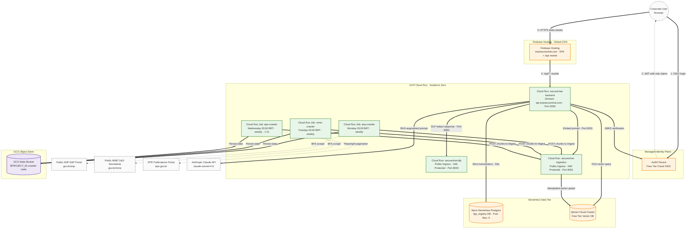

# Enterprise-SecureChat: GCP Deployment Guide

## 0. Pre-Deployment Variables

Set these shell variables once at the start of every session — all commands below reference them.

```bash
# GCP project targeting
export PROJECT_ID=enp-securechat          # change for a new GCP project
export REGION=us-east4
export REGISTRY=$REGION-docker.pkg.dev/$PROJECT_ID/securechat-repo
export BUCKET=$PROJECT_ID-crawler-state

# External service credentials (same for every GCP project unless you rotate them)
export NEON_DB_URL="jdbc:postgresql://ep-billowing-frost-ap4xcz7j.c-7.us-east-1.aws.neon.tech/fga_registry?sslmode=require"
export NEON_DB_USER="neondb_owner"
export QDRANT_CLOUD_URL="https://e8ab552c-8f40-4bbd-86ec-66758725942f.us-east4-0.gcp.cloud.qdrant.io:6333"
export AUTH0_ISSUER="https://dev-ll8lyragj23p2c7l.us.auth0.com/"
export AUTH0_AUDIENCE="api.enpsecurechat.com"
export APP_DOMAIN="enpsecurechat.com"
```

> **When deploying to a new GCP project:** only `PROJECT_ID` and `BUCKET` change. All external service credentials (Neon, Qdrant, Auth0, Anthropic) remain the same unless you explicitly rotate or replace them.

---

## 1. Objective & Architectural Boundaries

- **Role:** GCP Cloud Architect / Senior DevOps Engineer. Do not modify Java, Angular, Python, or TypeScript application source code.
- **Cost model:** Zero idle cost. All Cloud Run services run with `--min-instances=0` (scale-to-zero). The Angular frontend is served by Firebase Hosting (global CDN — no container, no idle cost).
- **Security mesh:** `securechat-dlp` and `securechat-ingestion` are deployed with `--ingress=all --allow-unauthenticated`. **Do NOT use `--ingress=internal`** — Cloud Run-to-Cloud Run calls via `.run.app` URLs travel over the public internet and are treated as external traffic by Google's load balancer; `--ingress=internal` silently blocks them with a Google infrastructure 404 before the container ever receives the request. The IAM `allUsers:run.invoker` binding is the access boundary, not network ingress.
- **Cold-start timeouts:** `securechat-ingestion` (sentence-transformers) takes ~60 s to cold-start; `securechat-dlp` (spaCy `pt_core_news_lg` + Presidio) takes ~30 s. The backend is already configured with matching read-timeouts (`embed-service.read-timeout: 90000`, `dlp-service.read-timeout: 60000`).

---

## 2. System Topology



---

## 3. Local Docker Compose Development

Use this before or instead of Cloud Run for local testing.

**Prerequisites:** `infra/.env` filled in (copy from `infra/.env.example`).

```bash
cd infra
docker compose up -d
```

- There is **no `frontend` service** in docker-compose — the Angular dev server runs separately via `npm start` inside `frontend/` (uses `proxy.conf.json` to forward `/api/` to `http://localhost:3000`).
- The `backend` service reads all credentials from `infra/.env` via `env_file`.
- The local `qdrant` container runs idle if `QDRANT_URL` in `.env` points to Qdrant Cloud — this is intentional so local tests use the same vector index as production.
- There is **no Keycloak** — identity is Auth0 cloud. The `keycloak` service was removed from docker-compose.

One-shot document indexing (ingestion container must be running):
```bash
docker compose run --rm ingestion python -m src.main --manifest manifests/og-manifest.yaml
```

---

## 4. Cloud Run Deployment

Run phases in order. Every command references the variables from Section 0.

### Phase 0 — Enable GCP APIs *(once per new project)*

```bash
gcloud config set project $PROJECT_ID

gcloud services enable \
  run.googleapis.com \
  artifactregistry.googleapis.com \
  cloudbuild.googleapis.com \
  cloudscheduler.googleapis.com \
  cloudresourcemanager.googleapis.com \
  secretmanager.googleapis.com \
  storage.googleapis.com
```

### Phase 1 — Artifact Registry + Secret Manager

Create the Docker repository:
```bash
gcloud artifacts repositories create securechat-repo \
  --repository-format=docker --location=$REGION
gcloud auth configure-docker $REGION-docker.pkg.dev
```

Create the four secrets (run interactively — paste values when prompted):
```bash
printf '%s' "$ANTHROPIC_API_KEY_VALUE"       | gcloud secrets create ANTHROPIC_API_KEY       --data-file=-
printf '%s' "$QDRANT_API_KEY_VALUE"           | gcloud secrets create QDRANT_API_KEY           --data-file=-
printf '%s' "$SPRING_DATASOURCE_PASSWORD_VAL" | gcloud secrets create SPRING_DATASOURCE_PASSWORD --data-file=-
printf '%s' "$INTERNAL_METRICS_KEY_VALUE"     | gcloud secrets create INTERNAL_METRICS_KEY     --data-file=-
```

> `INTERNAL_METRICS_KEY` (ADR-002) is a shared secret with `monitoring-links`, not a third-party credential — generate it with e.g. `openssl rand -hex 32` and hand the same value to whoever configures monitoring-links' poller. It gates `GET /internal/llm-metrics` via the `X-Internal-Key` header instead of Auth0 JWT.

Grant the default Compute SA permission to read the secrets:
```bash
PROJECT_NUMBER=$(gcloud projects describe $PROJECT_ID --format='value(projectNumber)')
SA="${PROJECT_NUMBER}-compute@developer.gserviceaccount.com"

for SECRET in ANTHROPIC_API_KEY QDRANT_API_KEY SPRING_DATASOURCE_PASSWORD INTERNAL_METRICS_KEY; do
  gcloud secrets add-iam-policy-binding $SECRET \
    --member="serviceAccount:${SA}" \
    --role="roles/secretmanager.secretAccessor"
done
```

### Phase 2 — Build Images

Build the backend, DLP, and ingestion images. The frontend is built and deployed automatically by the GitHub Actions workflow (Section 7) — no image needed.

```bash
# From project root
cd backend      && gcloud builds submit --tag $REGISTRY/securechat-backend:latest     --region=$REGION . && cd ..
cd dlp-service  && gcloud builds submit --tag $REGISTRY/securechat-dlp:latest         --region=$REGION . && cd ..
cd ingestion    && gcloud builds submit --tag $REGISTRY/securechat-ingestion:latest   --region=$REGION . && cd ..
```

### Phase 3 — Deploy Internal Services

Provision the crawler state bucket:
```bash
gcloud storage buckets create gs://$BUCKET --location=$REGION
```

Deploy DLP (port 8000):
```bash
gcloud run deploy securechat-dlp \
  --image $REGISTRY/securechat-dlp:latest \
  --region=$REGION --port=8000 --min-instances=0 \
  --ingress=all --allow-unauthenticated
```

Deploy Ingestion (port 8001):
```bash
gcloud run deploy securechat-ingestion \
  --image $REGISTRY/securechat-ingestion:latest \
  --region=$REGION --port=8001 --min-instances=0 \
  --ingress=all --allow-unauthenticated \
  --set-env-vars="QDRANT_URL=$QDRANT_CLOUD_URL" \
  --set-secrets="QDRANT_API_KEY=QDRANT_API_KEY:latest"
```

Capture URLs for the next phase:
```bash
DLP_URL=$(gcloud run services describe securechat-dlp    --region=$REGION --format='value(status.url)')
ING_URL=$(gcloud run services describe securechat-ingestion --region=$REGION --format='value(status.url)')
```

### Phase 4 — Deploy Backend

Deploy the backend:
```bash
gcloud run deploy securechat-backend \
  --image $REGISTRY/securechat-backend:latest \
  --region=$REGION --port=3000 --min-instances=0 \
  --ingress=all --allow-unauthenticated \
  --set-env-vars="SPRING_DATASOURCE_URL=$NEON_DB_URL,SPRING_DATASOURCE_USERNAME=$NEON_DB_USER,QDRANT_URL=$QDRANT_CLOUD_URL,AUTH0_ISSUER_URI=$AUTH0_ISSUER,AUTH0_AUDIENCE=$AUTH0_AUDIENCE,DLP_SERVICE_URL=$DLP_URL,EMBED_SERVICE_URL=$ING_URL,CORS_ALLOWED_ORIGINS=https://enpsecurechat.com" \
  --set-secrets="ANTHROPIC_API_KEY=ANTHROPIC_API_KEY:latest,QDRANT_API_KEY=QDRANT_API_KEY:latest,SPRING_DATASOURCE_PASSWORD=SPRING_DATASOURCE_PASSWORD:latest,INTERNAL_METRICS_KEY=INTERNAL_METRICS_KEY:latest"
```

> **Note on `backend.yml`'s redeploys:** the CI workflow's `gcloud run deploy` (Section 7) passes no `--set-env-vars`/`--set-secrets` at all — Cloud Run inherits every unspecified field from the previously serving revision, so secrets/env vars configured here (or via a one-off `gcloud run services update --update-secrets=...`) persist across ordinary code-triggered redeploys without needing to touch the workflow file. If a secret is ever missing after a deploy, it means it was never attached to any prior revision, not that CI dropped it.

The frontend is deployed to Firebase Hosting — see Section 6.

### Phase 5 — Crawler Jobs

> **Known gcloud CLI bug:** `--add-volume-mount` incorrectly rejects valid Unix absolute paths. Use the YAML manifests instead.

Edit each YAML file: replace `INGEST_URL` with `$ING_URL/ingest` and `namespace` with your project number. Then apply all three:
```bash
gcloud run jobs replace infra/crawler-job.yaml     --region=$REGION
gcloud run jobs replace infra/mme-crawler-job.yaml --region=$REGION
gcloud run jobs replace infra/epe-crawler-job.yaml --region=$REGION
```

Grant the Compute SA write access to the shared state bucket:
```bash
PROJECT_NUMBER=$(gcloud projects describe $PROJECT_ID --format='value(projectNumber)')
gcloud storage buckets add-iam-policy-binding gs://$BUCKET \
  --member="serviceAccount:${PROJECT_NUMBER}-compute@developer.gserviceaccount.com" \
  --role="roles/storage.objectAdmin"
```

Create weekly Cloud Scheduler triggers — one per day (Mon/Tue/Wed), all at 03:00 BRT. ANP and MME run `CRAWLER_MODE=all` with a 7200 s timeout, so a single 1 h stagger on the same day is not a safe guarantee against overlap; separate days remove the dependency on run duration entirely. Each job also writes to its own state file in the shared GCS bucket, so there is no storage-layer contention either way — see [ingestion/CLAUDE.md](ingestion/CLAUDE.md#cloud-run-job-schedule).

```bash
# ANP — Monday 03:00 BRT
gcloud scheduler jobs create http anp-crawler-schedule \
  --location=$REGION \
  --schedule="0 3 * * 1" \
  --uri="https://$REGION-run.googleapis.com/apis/run.googleapis.com/v1/namespaces/${PROJECT_NUMBER}/jobs/anp-crawler-job:run" \
  --message-body="{}" \
  --oauth-service-account-email="${PROJECT_NUMBER}-compute@developer.gserviceaccount.com" \
  --time-zone="America/Sao_Paulo"

# MME — Tuesday 03:00 BRT
gcloud scheduler jobs create http mme-crawler-schedule \
  --location=$REGION \
  --schedule="0 3 * * 2" \
  --uri="https://$REGION-run.googleapis.com/apis/run.googleapis.com/v1/namespaces/${PROJECT_NUMBER}/jobs/mme-crawler-job:run" \
  --message-body="{}" \
  --oauth-service-account-email="${PROJECT_NUMBER}-compute@developer.gserviceaccount.com" \
  --time-zone="America/Sao_Paulo"

# EPE — Wednesday 03:00 BRT
gcloud scheduler jobs create http epe-crawler-schedule \
  --location=$REGION \
  --schedule="0 3 * * 3" \
  --uri="https://$REGION-run.googleapis.com/apis/run.googleapis.com/v1/namespaces/${PROJECT_NUMBER}/jobs/epe-crawler-job:run" \
  --message-body="{}" \
  --oauth-service-account-email="${PROJECT_NUMBER}-compute@developer.gserviceaccount.com" \
  --time-zone="America/Sao_Paulo"
```

### Phase 6 — Custom Domain Mapping

> Use `gcloud beta run domain-mappings` — the GA command group errors on managed Cloud Run.

Backend API domain:
```bash
gcloud beta run domain-mappings create \
  --service=securechat-backend --domain=api.$APP_DOMAIN \
  --platform=managed --region=$REGION
```

The command outputs A/AAAA records — add them at your DNS registrar. SSL certificate provisioning takes up to 24 hours.

**Frontend domain** — Managed via Firebase Hosting, not Cloud Run domain mappings. Go to Firebase Console → Hosting → Add custom domain → `enpsecurechat.com`. Firebase provisions SSL and provides DNS records.

---

## 5. Verification Checklist

Run after every phase. Do not rely on clean CLI exit codes alone.

**Service readiness:**
```bash
gcloud run services describe [SERVICE_NAME] --region=$REGION \
  --format="value(status.conditions[0].status,status.conditions[0].message)"
```
Must return `True`. `False` with no message means the container crashed on startup — inspect logs immediately.

**Log inspection:**
```bash
gcloud logging read \
  "resource.type=cloud_run_revision AND resource.labels.service_name=[SERVICE_NAME]" \
  --limit=100 --format="value(textPayload)"
```

| Service | What to confirm |
|---|---|
| `securechat-backend` | No `HikariPool-1 - Connection is not available` or `SQLException` |
| `securechat-ingestion` | Uvicorn prints startup completion; no `ModuleNotFoundError` |
| `securechat-dlp` | Uvicorn prints startup completion; no spaCy model exceptions |

**Ingress audit** (both must show `run.googleapis.com/ingress: all`):
```bash
gcloud run services describe securechat-ingestion --region=$REGION --format='value(spec.template.metadata.annotations)'
gcloud run services describe securechat-dlp        --region=$REGION --format='value(spec.template.metadata.annotations)'
```
If either shows `ingress=internal`, Cloud Run-to-Cloud Run calls will be blocked at the load balancer with a Google infrastructure 404. The container will show zero log entries at the time of the call — that is the diagnostic signal.

**End-to-end smoke test:**
```bash
# Should return 200 with a JSON health object
curl -s https://api.$APP_DOMAIN/api/health
```

---

## 6. Firebase Hosting (Frontend)

The Angular frontend is served via Firebase Hosting — not Cloud Run. `firebase.json` and `.firebaserc` live at the repo root and are already configured for project `enp-securechat`.

**GCP project registration (one-time):** Visit `console.firebase.google.com`, select the `enp-securechat` GCP project, and enable Hosting. Required before any deploy — `firebase deploy` will fail with "project not found" if skipped.

**Manual deploy (local):**
```bash
npm install -g firebase-tools
firebase login

cd frontend && npm run build && cd ..
firebase deploy --only hosting
```

**`/api/**` rewrite** — Firebase Hosting rewrites these requests directly to the `securechat-backend` Cloud Run service (same GCP project, `us-east4`). No nginx container needed.

**Custom domain** — Managed via Firebase Console → Hosting → Custom domain. Add `enpsecurechat.com`; Firebase provisions the SSL certificate and provides DNS records to set at your registrar.

**Local dev** — `npm start` inside `frontend/` uses `proxy.conf.json` to forward `/api/` to `http://localhost:3000`. The Docker Compose stack runs the backend, ingestion, DLP, and Qdrant; the Angular dev server runs separately.

---

## 7. GitHub Actions CI/CD

Workflows live in `.github/workflows/`. Each triggers only on path-filtered pushes to `main`.

| Workflow | Trigger paths | Action |
|---|---|---|
| `frontend.yml` | `frontend/**`, `firebase.json`, `.firebaserc` | `npm run build` → `firebase deploy --only hosting` |
| `backend.yml` | `backend/**` | Docker build on runner → `gcloud run deploy securechat-backend` |
| `ingestion.yml` | `ingestion/**` | Docker build on runner → `gcloud run deploy securechat-ingestion` |
| `dlp.yml` | `dlp-service/**` | Docker build on runner → `gcloud run deploy securechat-dlp` |
| `crawler.yml` | `infra/crawler-job.yaml`, `infra/mme-crawler-job.yaml`, `infra/epe-crawler-job.yaml`, **or** completion of `ingestion.yml` | `gcloud run jobs replace` for all three jobs |

### Required GitHub Secrets

| Secret | Used by | How to obtain |
|---|---|---|
| `GCP_SA_KEY` | all workflows | Service account JSON key for `github-cicd` — see setup below |

### GCP service account setup (one-time)

In GCP Console → IAM & Admin → Service Accounts → Create service account `github-cicd`, grant these roles:

- `roles/run.admin` — deploy Cloud Run services and update the crawler job
- `roles/artifactregistry.writer` — push Docker images to Artifact Registry
- `roles/iam.serviceAccountUser` — required by `gcloud run deploy` to bind the runtime service account
- `roles/firebase.admin` — deploy Firebase Hosting and read project metadata

Then Keys → Add Key → JSON. Paste the downloaded JSON as the `GCP_SA_KEY` GitHub secret.

> **Note:** `github-firebase-deploy` is not needed — it was created for a legacy Firebase GitHub Action that has since been replaced by the explicit `firebase deploy --only hosting` CLI call authenticated via `GCP_SA_KEY`.
