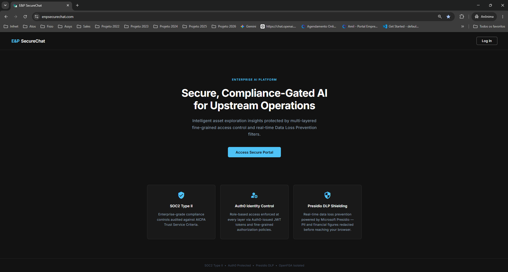
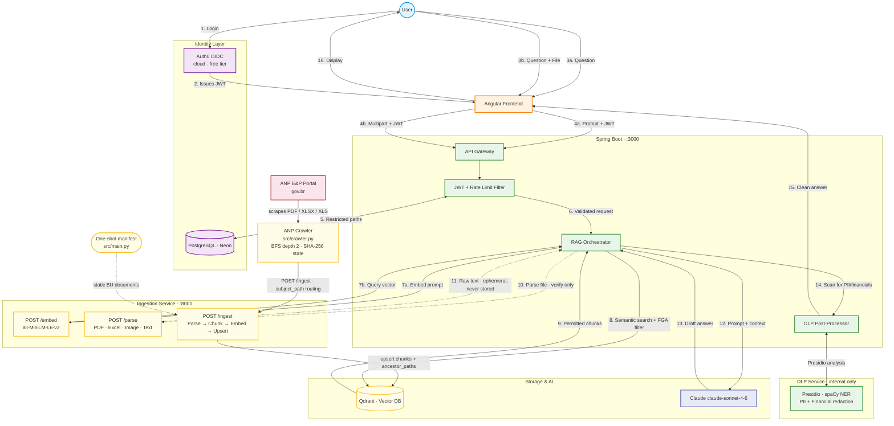

# E&P SecureChat — Exploration & Production Intelligence

> An enterprise-grade AI assistant purpose-built for the Oil & Gas sector. Every answer is drawn from indexed company documents, filtered at the vector-database layer by the caller's exact role, and scrubbed of financial figures and PII before it leaves the backend — with zero raw prompt data ever touching disk.

---

## Architectural Trade-offs & Engineering Decisions

These five decisions define how the system handles the hardest enterprise constraints — authorization integrity, connection pool exhaustion, real-time compliance, audit completeness, and operational observability. Each required choosing between two approaches that both appear reasonable, and each choice has a concrete consequence if reversed.

### 1. FGA Enforced at the Storage Layer, Not the Application Layer

`FgaService.buildQdrantFilter()` produces a `must_not` filter on the `ancestor_paths` payload field passed directly to Qdrant — before any embedding is ranked, before any chunk reaches Java, before the LLM is invoked.

**Why not filter in application code?** Post-retrieval filtering is architecturally unsafe in a RAG system. If Qdrant returns 10 chunks and Java discards 3 due to FGA rules, the LLM still receives 7 chunks — but those 7 were semantically ranked relative to the full corpus, including the restricted documents. The ranking itself leaks signal. Enforcing at the storage layer makes restricted documents invisible to the semantic search, not merely dropped after it.

**The contract:** Every ingested document carries `ancestor_paths: ["bu", "bu/santos", "bu/santos/reserves"]`. Restricting a parent path silently blocks all descendants — no recursive traversal required. If the field name diverges between the ingestion pipeline and `FgaService`, the security model breaks silently with no runtime error. This is the most critical invariant in the codebase.

### 2. Non-Transactional RAG Orchestration

`RagService.chat()` and `chatStream()` are deliberately not annotated `@Transactional`.

The RAG orchestration method performs three sequential external HTTP calls: an embed call to the ingestion service (~1–2 s), a Qdrant semantic search (~1–5 s), and Claude inference (~15–60 s). Annotating this method `@Transactional` would hold a HikariCP connection open for the full duration. With `maximum-pool-size: 5` (Neon free-tier limit), five concurrent users would exhaust the pool entirely and all subsequent requests would queue behind them. Each database operation — conversation save, audit log write — runs in its own short-lived transaction via the injected services instead.

### 3. Post-LLM DLP with Sentence-Boundary Buffering

DLP runs after Claude generates its answer. For the SSE streaming endpoint, tokens are buffered until a sentence boundary is confirmed before being dispatched to the Presidio microservice.

**Why not redact before sending to Claude?** An authorized `reserves-management` user querying barrel prices would receive a response grounded in `[REDACTED]` context — producing useless output. The FGA layer governs which documents a user can reach; DLP governs what figures escape into the final answer regardless of authorization. These are orthogonal concerns: collapsing them would break the system for the users it's designed to serve.

**Why sentence boundaries?** Microsoft Presidio's NER models require full sentence context. A person's name or a financial clause split across two token batches may go undetected. Buffering to a confirmed sentence boundary ensures Presidio has sufficient context for accurate entity detection. Cross-sentence entity spans remain a known limitation of this approach.

**Why `pt_core_news_lg`?** Brazilian geological basin and field names — Pré-Sal, Campos, Santos — are classified as `LOC`/`GPE` by the Portuguese model. The English `en_core_web_lg` misclassifies them as `PERSON`, producing false positives that redact core O&G terminology.

### 4. Zero-Trace Compliance Audit

`AuditService.log()` stores `SHA-256(rawPrompt)` in `restriction_audit_log.query_hash`. The raw prompt string is hashed in memory and immediately discarded — it is never written to any database column, log stream, or audit record.

The audit log must satisfy two competing requirements: prove a specific query was submitted, and ensure the prompt content cannot be reconstructed at rest. A SHA-256 hash satisfies the first (by providing the plaintext for verification) while making reconstruction computationally infeasible. This also eliminates any LGPD data-residency concern about storing raw user input.

### 5. Fire-and-Forget LLM Observability, Not a Managed Platform

ADR-002 rejects a managed or self-hosted LLM observability platform (Langfuse, Phoenix) in favor of bespoke logging into the app's existing Neon database, aggregated by a separate `monitoring-links` service and rendered on an external dashboard.

**Why not Langfuse?** A managed tracing platform means a new external dependency, a new credential to rotate, and (for the hosted tier) sending prompt/response content to a third party — which cuts against the same "zero-trace" posture that shapes the audit log in §4. A single `llm_telemetry` row (latency, token estimate, cost estimate, success flag) captures everything the operational dashboard actually needs without a new trust boundary.

**Why fire-and-forget instead of synchronous?** `RagService` dispatches the telemetry write via `CompletableFuture.runAsync(...)` on a small bounded executor (core 2 / max 4 / queue 100, `DiscardPolicy`) — never blocking the chat response, and never propagating a telemetry failure into a user-facing error. If the queue is ever full, an event is silently dropped rather than slowing down or breaking a chat request; observability is explicitly lower-priority than the product itself.

**The trade-off:** token counts are a chars/4 heuristic, not Anthropic's real `usage` field — capturing exact counts would mean changing `ClaudeService.complete()`'s return type on every call site. Cost figures are accordingly estimates, adequate for a trend-level dashboard but not for billing reconciliation. `GET /internal/llm-metrics` is gated by a shared-secret header rather than Auth0 JWT, since its only caller is another backend, not a logged-in user.

### Residual Security Risks

The three-layer security mesh (FGA + DLP + audit log) is strong on the output side — what users receive is tightly controlled. The following risks exist on the input side of the LLM call and are documented here to set accurate expectations for any deployment.

| Risk | Real? | Mitigation in place |
|---|---|---|
| **Raw document chunks sent to Anthropic API** | Yes | Anthropic's enterprise data processing agreement prohibits training on API input. Shifting DLP left is architecturally possible but breaks RAG quality for authorized users — see §3 above. |
| **Qdrant stores unredacted chunk text** | Yes | Qdrant API key required for all operations; the `qdrant` container is on an isolated Docker network with no public port. If Qdrant is compromised, raw chunk text is exposed. |
| **Spring Boot HTTP client logging** | Mitigated | `org.springframework.web.client` is pinned to `WARN` in `application.yml`. At `DEBUG`, Spring's `RestClient` emits request headers — which would expose the `x-api-key` sent to Anthropic. |

**Alternative: keep data inside your cloud boundary.** If sending raw text to Anthropic's API is unacceptable under your data classification policy, routing Claude calls through AWS Bedrock or GCP Vertex AI keeps inference within your cloud region under that provider's enterprise data agreements. The only code change required is the base URL and auth headers in `RestClientConfig.java`.

---

## Product Overview

E&P SecureChat transforms how Exploration & Production teams interact with their institutional knowledge. Analysts, reservoir engineers, BU managers, and compliance officers all share a single conversational interface — yet each sees precisely what their role permits, enforced not by application logic that can be bypassed, but by a cryptographic path filter applied inside the vector database before the language model is ever invoked.

<br/>

<p align="center">
  
</p>

<br/>

### Key Capabilities

**Local-First to Serverless RAG**
Documents are parsed, chunked into 512-token segments with 64-token overlap, embedded with `all-MiniLM-L6-v2` (384-dim), and written to Qdrant with a hierarchical `ancestor_paths` payload. The same pipeline runs identically on Docker Compose locally or across four Cloud Run services at zero idle cost. No external embedding API is required — the ingestion service owns the full vector lifecycle.

**Ephemeral Document Verification**
Analysts can attach a PDF, Excel sheet, or scanned image directly to a query. The backend routes the multipart upload to `POST /api/chat/verify`, which parses the file ephemerally via the ingestion service, injects the raw text into the Claude system prompt alongside the indexed knowledge base, and discards the document text after the response is generated. Nothing from the uploaded file is persisted in conversation history, the audit log, or the vector store.

**Automated ANP Regulatory Crawling**
A built-in BFS crawler targets the ANP Exploração e Produção portal (`gov.br/anp`) up to depth 2. It downloads PDF, XLSX, and XLS files and can optionally extract editorial text directly from ANP HTML pages using Plone CMS selectors. Crawl state is maintained as a SHA-256 map — subsequent runs skip unchanged content via HEAD-only size probes in ~0.5 s per file. On GCP, the crawler runs as a scheduled Cloud Run Job every Monday at 03:00 BRT.

---

## Visual Product Tour

### The Workspace — BU-Scoped Intelligence


A BU analyst authenticated as `alice` queries the Santos basin asset valuation. The Angular 17 Material interface presents a persistent sidebar with full conversation history on the left and a clean chat workspace on the right. The response is rendered as structured Markdown — numbered sections for Reserves Volumes, Investment Projections, Recovery Improvements, and Key Observations — sourced from the document `BU-SANTOS-SAN-RESERVES-2026 (Classification: RESTRICTED / SANTOS RESERVES MANAGEMENT)`.

Notice the orange-highlighted spans throughout the answer: those are **live DLP redactions**. The raw Claude output contained explicit financial figures and reserve volumes; the Presidio post-processor intercepted them before the response reached the browser, replacing each entity with a highlighted `[REDACTED]` marker. The BU user receives the structural insight without exposure to the numerical data their role does not permit.

---

### Context-Aware Insights — Reserves Coordination View


The same query issued by a `reserves-coordination` user surfaces the full unredacted analysis: **Santos Basin Asset Valuation — Merkuza Extraction Data Analysis**. Because this role carries cross-BU read access, the FGA filter returns richer context from the Qdrant search — and because the DLP entity rules are calibrated per authority level, the financial figures pass through.

The response demonstrates the RAG pipeline's citation fidelity: specific document references are embedded inline (e.g., `BI-SANTOS SAN RESERVES 2026`), investment expenditure is structured as `USD 140 million` with a named investment plan, and recovery improvements are grounded in a specific extraction data set. Section 4 surfaces a compliance note directly from the source document: *"This document is classified as RESTRICTED // SANTOS RESERVES MANAGEMENT — cross-BU production data may only appear in a comprehensive full-field valuation."*

---

### Access Control Administration


The Admin panel — accessible only to users with the `admin` role via `@PreAuthorize("hasRole('admin')")` on every endpoint — exposes two panels. The **Add Restriction** form on the left allows an administrator to bind any role to any subject path with an optional reason that is persisted to the audit log. The **Restriction Matrix** on the right lists all active restrictions with their role, subject path, and creation date, and provides a per-row delete action.

The **Restriction Audit Log** at the bottom is the compliance backbone: every query that triggered an FGA restriction is recorded with its timestamp, user ID (hashed), blocked path, and a query hash — the SHA-256 of the raw prompt. No plaintext query text is ever stored. The audit log satisfies the requirement to prove a query occurred while ensuring the prompt content itself cannot be reconstructed from the database.

---

### Document Verification with Role-Based Redaction


An admin user runs a document verification query with four attached reserve reports (visible as file chips at the bottom of the input bar: `san-field-update.pdf`, `alb-campo-valuation.pdf`, `sol-producao-anual.pdf`, and a fourth). The response synthesizes the uploaded documents against the indexed knowledge base and presents a focused summary of the numerical reserve data.

The DLP pipeline is active for all roles, but the entity allowlist is tiered by clearance. `admin` users see all O&G domain entities unredacted (`OG_VOLUMES`, `FINANCIAL_FIGURE`, `RESERVES_VARIATION`, `INVESTMENT_YEAR`, `OG_CONTRACT`, `COMMODITY_PRICE`, `ANP_PROCESS`) — PII entities (`PERSON`, `EMAIL_ADDRESS`, `PHONE_NUMBER`, `CREDIT_CARD`) are always redacted regardless of role. The `max_tokens=2048` budget for the verify endpoint ensures full compliance reports are never truncated mid-analysis.

---

## The Multi-Layered Security Mesh

E&P SecureChat enforces data protection at three independent layers. Disabling any one of them would require a deliberate code change — there is no configuration flag that removes a layer.

### Fine-Grained Authorization (FGA)

> **How it works:** When a document at `bu/santos/reserves/field-update.pdf` is ingested, the pipeline writes `ancestor_paths: ["bu", "bu/santos", "bu/santos/reserves"]` into the Qdrant payload. When `FgaService.buildQdrantFilter()` runs for a user whose role is restricted from `bu/santos`, it produces a `must_not` filter passed directly to `QdrantSearchClient.search()` — before the embedding is even ranked. Every document at `bu/santos/*` is excluded **mathematically** by the vector database, not by post-filtering in Java. Restricting a parent path silently blocks all descendants with no recursive logic required.
>
> **Why it cannot be bypassed:** The filter is constructed from the live restriction table at request time (not cached) and is the only argument passed to Qdrant. There is no secondary search path to `/api/chat`. Spring Security's `@PreAuthorize` blocks non-admin users from modifying the restriction table.

### Role-Aware Data Loss Prevention (DLP)

> **How it works:** After Claude generates its draft answer, the backend sends the full response text to `http://dlp-service:8000/dlp/analyze`. The DLP microservice runs Microsoft Presidio with a Portuguese spaCy NER model (`pt_core_news_lg`) and eight custom O&G recognizers covering financial figures, reserve volumes, ANP process numbers, reserve variation percentages, investment years, contract terms, commodity prices, and document dates. Any detected entity is replaced with `[REDACTED]` before the response is returned to the Angular client. The entity set is tiered by role: `admin` users have all O&G domain entities allowed through; `reserves-coordination` and `reserves-management` have volumes and financials allowed through; all other roles receive full redaction. PII entities (`PERSON`, `EMAIL_ADDRESS`, `PHONE_NUMBER`, `CREDIT_CARD`) are always redacted for every role.
>
> **Why it is blocking (non-streaming):** Presidio's NER models require complete sentence context. A person's name or a financial clause split across two streamed chunks may not be detected. The `/api/chat` endpoint intentionally waits for the full Claude response before calling DLP. When streaming is added in a future milestone, a sentence-buffer flush approach is required.
>
> **Why `pt_core_news_lg` and not the English model:** Brazilian geological basin and field names (Pré-Sal, Campos, Santos) are classified as `LOC`/`GPE` by the Portuguese model. The English `en_core_web_lg` misclassifies them as `PERSON`, producing false positives that redact core O&G terminology.

### Zero-Trace Compliance Logging

> **How it works:** `AuditService.log()` computes `SHA-256(rawPrompt)` and stores only the hash in `restriction_audit_log.query_hash`. The raw prompt string is passed in, hashed, and immediately discarded — it is never written to any database column, log stream, or audit record. The hash is sufficient to prove a specific query was submitted (by providing the plaintext for hash verification) without exposing the prompt content at rest.
>
> **Rate limiting:** `POST /api/chat` and `POST /api/chat/verify` share a Bucket4j in-memory token bucket of 20 requests per minute per `sub` JWT claim. Exceeding the limit returns HTTP 429. The rate limiter is keyed to the authenticated identity, not the IP address.

---

## Under-the-Hood Architecture

The diagram below traces a complete user request from browser to response, including both the fast path (text-only chat) and the ephemeral document verification path.



---

## Technical Stack & Specifications

| Layer | Technology | Notes |
|---|---|---|
| **Frontend** | Angular 17 (standalone) + Angular Material 17 | Auth0 OIDC via `@auth0/auth0-angular`; Markdown rendered through `marked` + DOMPurify (`SafeMarkdownPipe`) |
| **Backend** | Spring Boot 3.3 / Java 21 | `RagService.chat()` is deliberately non-`@Transactional` — HikariCP pool size 5 (Neon free tier); all external HTTP calls run outside any transaction boundary |
| **Identity** | Auth0 (cloud, free tier) | Post-Login Action injects O&G roles into `https://enpsecurechat.com/roles` JWT claim; `OgRolesAndGroupExtractor` maps to Spring `ROLE_` authorities |
| **Vector DB** | Qdrant 1.9 | FGA enforced via `must_not` filter on `ancestor_paths` payload at query time; 384-dim collection; Docker locally, Qdrant Cloud on GCP |
| **Relational Store** | Neon (serverless PostgreSQL) | Hosts `fga_registry` DB: FGA restriction table, conversation/message history, SHA-256 audit log |
| **LLM Engine** | Claude `claude-sonnet-4-6` via Anthropic Messages API | 1024 `max_tokens` for chat; 2048 for document verification; model configurable via `CLAUDE_MODEL` env var |
| **Ingestion Pipeline** | Python 3.11 · FastAPI · sentence-transformers | `all-MiniLM-L6-v2` embedder; LangChain `RecursiveCharacterTextSplitter` (512 tok / 64 overlap); parsers: pdfminer + pytesseract (OCR), openpyxl/xlrd, Pillow |
| **Compliance / DLP** | Python 3.11 · FastAPI · Microsoft Presidio · spaCy `pt_core_news_lg` | 8 custom O&G recognizers; internal Docker network only — no public port; Portuguese NLP model to correctly classify Brazilian basin/field names |
| **Rate Limiting** | Bucket4j 8.10 | 20 req/min per `sub` claim; in-memory token buckets; shared across `/api/chat` and `/api/chat/verify` |
| **Infrastructure** | Docker Compose (local) · GCP Cloud Run (production) | Scale-to-zero on Cloud Run; ANP crawler runs as a scheduled Cloud Run Job |

---

## Quick Start

### 1. Configure credentials

```bash
git clone <repo-url>
cd Enterprise-SecureChat
cp infra/.env.example infra/.env
```

Edit `infra/.env` with your Neon JDBC URL, Auth0 tenant settings, Anthropic API key, and Qdrant credentials:

```env
SPRING_DATASOURCE_URL=jdbc:postgresql://ep-xxxx.region.aws.neon.tech/fga_registry?sslmode=require&user=xxx&password=xxx
AUTH0_ISSUER_URI=https://dev-xxx.us.auth0.com/
AUTH0_AUDIENCE=api.enpsecurechat.com
ANTHROPIC_API_KEY=sk-ant-api03-...
QDRANT_API_KEY=your-qdrant-key
```

### 2. Apply the database schema

Open the Neon SQL Editor for your `fga_registry` database and paste the contents of `infra/migrations/init.sql`. This creates the FGA registry tables, conversation history, SHA-256 audit log, and seeds the five default O&G roles.

### 3. Start all services

```bash
cd infra
docker compose up -d
```

| Service | Endpoint | Role |
|---|---|---|
| Frontend | http://localhost:4200 | Angular SPA (nginx) |
| Backend | http://localhost:3000 | Spring Boot API gateway |
| Qdrant | http://localhost:6333 | Vector DB + dashboard |
| DLP | internal only | `dlp-service:8000` on backend network |

### 4. Index the baseline document corpus

```bash
# Runs one-shot against the persistent ingestion service started in step 3
cd infra
docker compose run --rm ingestion \
  python -m src.main --manifest manifests/og-manifest.yaml
```

This indexes the BU reserves documents under `bu/<name>/reserves` and regulatory content under `bar-questions`. The operation is fully idempotent — re-running never creates duplicate vectors.

### 5. Populate the ANP regulatory knowledge base (optional)

```bash
# Index PDF/XLSX/XLS files from the ANP E&P portal
docker compose run --rm \
  -e INGEST_URL=http://ingestion:8001/ingest \
  ingestion python -m src.crawler

# Also index HTML page text (recommended for complete regulatory coverage)
docker compose run --rm \
  -e INGEST_URL=http://ingestion:8001/ingest \
  ingestion python -m src.crawler --mode all
```

The crawler maintains a SHA-256 state file — subsequent runs skip unchanged content in ~0.5 s per file via HEAD-only size probes.

### 6. Open the application

Navigate to http://localhost:4200. Auth0 Universal Login handles authentication. After login, role-based FGA restrictions are active immediately — no restart required. Add or modify restrictions via the **Admin** panel (requires the `admin` role).

---

## Role Reference

| Role | Access Scope | Can Upload Documents |
|---|---|---|
| `admin` | Unrestricted + admin panel | — |
| `employee` | General company knowledge base | No |
| `bu-user` | Own BU path only (`bu/<name>/reserves`) | Yes |
| `reserves-management` | Cross-BU reserves access | Yes |
| `reserves-coordination` | Cross-BU reserves + `bar-questions` regulatory | Yes |
| `reservoir-team` | Reservoir engineering read-only; blocked from `bar-questions` | No |

