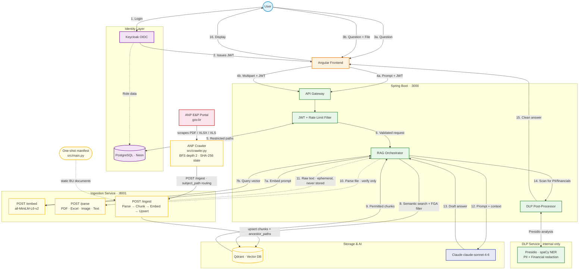

# Enterprise SecureChat

An enterprise AI chat platform that answers questions using your company's own documents — with three security layers built in:

- **FGA (Fine-Grained Authorization)** — Qdrant-level path filtering ensures users only retrieve documents they are permitted to read. There is no application-layer bypass.
- **DLP (Data Loss Prevention)** — Microsoft Presidio scrubs PII and financial figures from every LLM answer before it reaches the browser. Raw Claude output never leaves the backend.
- **Audit Trail** — Every query logs the user, their roles, the paths that were blocked, and a SHA-256 hash of the prompt. The raw prompt is never stored.
- **Document Verification** — Upload a file (PDF, Excel, image, or plain text) and ask the system to cross-reference it against the indexed knowledge base. The document is parsed ephemerally, injected into the Claude context, and never persisted.

---

## Architecture



---

## Tech Stack

| Layer | Technology |
|-------|-----------|
| Frontend | Angular 17 (standalone) + Angular Material 17 |
| Backend | Spring Boot 3.3 / Java 21 |
| Identity | Keycloak 24 (Docker) |
| Vector DB | Qdrant 1.9 (Docker) |
| App DB | Neon (serverless PostgreSQL) |
| LLM | Claude `claude-sonnet-4-6` via Anthropic Messages API |
| Ingestion | Python 3.11 · sentence-transformers `all-MiniLM-L6-v2` · 384-dim vectors |
| DLP | Python 3.11 · FastAPI · Microsoft Presidio · spaCy `en_core_web_lg` |
| Rate Limiting | Bucket4j 8.10 (20 req/min per user, in-memory token buckets) |

---

## Prerequisites

| Requirement | Notes |
|-------------|-------|
| Docker Desktop | Runs Keycloak, Qdrant, backend, frontend, ingestion, DLP |
| Java 21 | Only needed for local backend development outside Docker |
| Python 3.11 | Only needed for local ingestion/DLP development outside Docker |
| [Neon account](https://neon.tech) | Free tier — create two databases: `fga_registry` and `keycloak` |
| Anthropic API key | Get one at [console.anthropic.com](https://console.anthropic.com/settings/keys) |

---

## Quick Start

### 1. Clone and configure

```bash
git clone <repo-url>
cd Enterprise-SecureChat
cp infra/.env.example infra/.env
```

Edit `infra/.env` and fill in:

```env
SPRING_DATASOURCE_URL=jdbc:postgresql://ep-xxxx.region.aws.neon.tech/fga_registry?sslmode=require&user=xxx&password=xxx
NEON_KEYCLOAK_URL=jdbc:postgresql://ep-xxxx.region.aws.neon.tech/keycloak?sslmode=require&user=xxx&password=xxx
ANTHROPIC_API_KEY=sk-ant-api03-...
QDRANT_API_KEY=your-local-qdrant-key
KEYCLOAK_ADMIN=admin
KEYCLOAK_ADMIN_PASSWORD=changeme
```

### 2. Apply the database schema

Open the Neon SQL Editor for your `fga_registry` database and paste the contents of `infra/migrations/init.sql`. This creates the FGA registry tables, conversation/message history, audit log, and seeds the five default roles.

### 3. Start all services

```bash
cd infra
docker compose up -d
```

Services come up in this order (Docker healthchecks handle dependencies):

| Service | URL | Notes |
|---------|-----|-------|
| Keycloak | http://localhost:8080 | OIDC issuer |
| Qdrant | http://localhost:6333 | Vector DB + dashboard |
| DLP | internal only | `dlp-service:8000` on backend network |
| Backend | http://localhost:3000 | Spring Boot |
| Frontend | http://localhost:4200 | Angular (served via nginx) |

### 4. Create users in Keycloak

1. Navigate to http://localhost:8080 → log in as admin
2. Select realm **enterprise-securechat**
3. Go to **Users → Add user** and create test users (e.g., `alice`, `bob`)
4. Under each user's **Credentials** tab, set a password (disable "Temporary")
5. Under **Role mappings**, assign realm roles: `admin`, `employee`, `bu-user`, `reserves-management`, `reserves-coordination`, or `reservoir-team`

### 5. Index documents

```bash
# One-shot ingest (ingestion service is already running as part of docker compose up -d)
cd infra
docker compose run --rm ingestion \
  python -m src.main --manifest manifests/og-manifest.yaml
```

The O&G manifest indexes reserves documents under `bu/<name>/reserves` and regulatory content under `bar-questions`. Add new documents by creating entries in `og-manifest.yaml` with the appropriate `subject_path`.

### 6. Start chatting

Open http://localhost:4200 — you will be redirected to Keycloak login. After authenticating, the chat interface is immediately available.

---

## Managing Restrictions

### Via the Admin Panel (recommended)

Log in as a user with the `admin` role and navigate to **Admin** in the top bar. The panel shows:

- **FGA Restriction Matrix** — all active path restrictions per role, with a delete button for each
- **Add Restriction** — role selector, subject path input, optional reason
- **Audit Log** — paginated table of every query that triggered FGA filtering

### Via the API

```bash
# List all roles and their restrictions
curl -H "Authorization: Bearer <admin-jwt>" http://localhost:3000/api/admin/roles

# Add a restriction: block reservoir-team from bar-questions
curl -X POST \
  -H "Authorization: Bearer <admin-jwt>" \
  -H "Content-Type: application/json" \
  -d '{"subjectPath":"bar-questions","reason":"Confidential regulatory content"}' \
  http://localhost:3000/api/admin/roles/reservoir-team/restrictions

# Remove the restriction
curl -X DELETE \
  -H "Authorization: Bearer <admin-jwt>" \
  "http://localhost:3000/api/admin/roles/reservoir-team/restrictions?subjectPath=bar-questions"
```

Changes apply to the **next** query — the FGA filter is built at request time from the database, not cached.

---

## Adding Documents

There are two ways to get documents into the knowledge base. Both paths are fully idempotent — re-running never creates duplicate vectors.

### Option A — Static manifest (company BU documents)

Create a YAML manifest:

```yaml
collection: enterprise_knowledge
documents:
  - path: data/bu/santos/reserves/san-field-update.pdf
    subject_path: bu/santos/reserves

  - path: data/bu/campos/reserves/alb-field-update.pdf
    subject_path: bu/campos/reserves

  - path: data/regulatory/bar-questions/anp-2026-audit.txt
    subject_path: bar-questions
```

Run ingestion:

```bash
docker compose run --rm ingestion \
  python -m src.main --manifest manifests/your-manifest.yaml
```

### Option B — ANP Regulatory Crawler (automated)

`ingestion/src/crawler.py` discovers and indexes documents from the ANP Exploração e Produção portal automatically.

```bash
# Run via Docker (recommended — uses same network as ingestion service)
docker compose run --rm \
  -e INGEST_URL=http://ingestion:8001/ingest \
  ingestion python -m src.crawler

# Run locally (ingestion service must be running separately)
INGEST_URL=http://localhost:8001/ingest python -m src.crawler
```

**How it works:**

1. BFS crawl of `gov.br/anp/pt-br/assuntos/exploracao-e-producao-de-oleo-e-gas` up to depth 2 — discovers all sub-pages in the ANP E&P section.
2. Collects all `.pdf`, `.xlsx`, and `.xls` links across all pages (de-duplicated).
3. Downloads each file and checks its SHA-256 hash against `ingestion/data/.crawler_state.json` — unchanged files are skipped.
4. Routes each file to the correct `subject_path`:
   - URL contains `reserva`, `recursos`, or `bar` → `bar-questions`
   - Everything else → `corporate-answers`
5. POSTs the file to the `/ingest` endpoint, which parses, chunks, embeds, and upserts to Qdrant.
6. Saves the state file so subsequent runs only process new or changed documents.

**Supported file types:** `.pdf` (with OCR fallback for scanned pages), `.xlsx`, `.xls`

**Rate limiting:** 3-second pause between requests to avoid gov.br CDN throttling.

**Stopping mid-run is safe** — documents already ingested before the interruption are live in Qdrant immediately. The state file is written only at the end, so any files not recorded will be retried on the next run.

If the crawler is rebuilt (e.g. after updating parsers), restart the persistent ingestion container before running it:

```bash
cd infra
docker compose up -d --no-deps ingestion   # picks up new image
docker compose run --rm -e INGEST_URL=http://ingestion:8001/ingest ingestion python -m src.crawler
```

---

## Security Deep Dive

### FGA: The `ancestor_paths` Guarantee

The core FGA trick lives in Qdrant's payload, not in application code. When a document at `finance/payroll/q3` is ingested, its `ancestor_paths` field is written as:

```json
["finance", "finance/payroll", "finance/payroll/q3"]
```

When `FgaService.buildQdrantFilter(["finance"])` runs, it produces:

```json
{
  "must_not": [
    { "key": "ancestor_paths", "match": { "any": ["finance"] } }
  ]
}
```

This single filter, applied **at the Qdrant search layer**, excludes every document that lists `"finance"` in its `ancestor_paths` — which is every document at `finance/*`, no matter how deep. Restricting a parent path blocks all descendants **mathematically**, without any recursive application-level logic.

There is no code path to `/api/chat` that bypasses this filter. The filter is built in `FgaService` and passed directly to `QdrantSearchClient.search()`. Spring Security's `@PreAuthorize` annotations prevent non-admin users from modifying restrictions.

### DLP: Why Blocking (Non-Streaming)

The `/api/chat` endpoint waits for Claude to finish generating the complete response before calling the DLP service. This is intentional:

Presidio's NER models (spaCy `en_core_web_lg`) require full sentence context to accurately detect named entities. Streaming token-by-token breaks entity detection at sentence boundaries — e.g., a person's name split across two chunks may not be flagged.

The DLP service redacts: `PERSON`, `EMAIL_ADDRESS`, `PHONE_NUMBER`, `CREDIT_CARD`, plus a custom `FINANCIAL_FIGURE` recognizer that catches `$125,000`, `€12.50`, `R$1.234,56`, `45 million USD`, `EUR 12,000`, and similar patterns.

### Document Verification

The paperclip button in the chat input opens a file picker. After attaching a file, send your question as normal — the backend routes the request through `POST /api/chat/verify` instead of `POST /api/chat`.

**How it works:**

1. The file is sent to the ingestion service's `POST /parse` endpoint, which runs the appropriate parser (PDF/Excel/image/text) and returns raw text.
2. The raw text is injected into Claude's system prompt alongside the RAG chunks from the knowledge base.
3. Claude compares the submitted document against the verified ground truth and flags discrepancies.
4. The full DLP pass runs on Claude's response — any PII or financial figures in the compliance report are redacted before reaching the browser.
5. Only `message + "[Attached: filename]"` is stored in conversation history. The document text is never persisted.

**Supported file types:** `.pdf`, `.xlsx`, `.xls`, `.png`, `.jpg`, `.jpeg`, `.tiff`, `.tif`, `.txt`, `.md`, `.csv`

**Token budget:** The verify endpoint requests `max_tokens=2048` from Claude (vs 1024 for regular chat) to ensure full compliance reports are not truncated.

---

### Rate Limiting

`POST /api/chat` and `POST /api/chat/verify` share the same **20 requests per minute per user** (`sub` JWT claim) bucket. Bucket4j uses in-memory token buckets refilled in full every 60 seconds. Exceeding the limit returns HTTP 429 with:

```json
{ "error": "Rate limit exceeded. Maximum 20 requests per minute." }
```

### Security Headers

Every response from the backend includes:

| Header | Value |
|--------|-------|
| `Content-Security-Policy` | `default-src 'self'; frame-ancestors 'none'` (+ script/style/img/connect) |
| `X-Frame-Options` | `DENY` |
| `X-Content-Type-Options` | `nosniff` |
| `Strict-Transport-Security` | `max-age=31536000; includeSubDomains` |
| `Referrer-Policy` | `strict-origin-when-cross-origin` |
| `Permissions-Policy` | `geolocation=(), microphone=(), camera=()` |

### Audit Log Integrity

`AuditService.log()` stores `SHA-256(prompt)` in `restriction_audit_log.query_hash`. The raw prompt text never touches the database. This satisfies audit requirements (queries can be proven to have occurred) without storing potentially sensitive prompt content.

---

## Development Guide

### Backend (Java 21)

```bash
cd backend
mvn spring-boot:run          # dev server on :3000
mvn test                     # run JUnit 5 tests
mvn package -DskipTests      # build JAR
```

**Key design constraint:** `RagService.chat()` is deliberately **not** `@Transactional`. External HTTP calls (embed ~5 s, Qdrant ~10 s, Claude ~60 s) happen inside this method. Annotating it `@Transactional` would hold a HikariCP connection for the entire duration — with `maximum-pool-size=5` (Neon free tier limit), five concurrent users would exhaust the pool.

### Frontend (Angular 17)

```bash
cd frontend
npm install
npm start                    # dev server on :4200 with /api proxy to :3000
npm run build                # production build → dist/.../browser/
npm test                     # Jest unit tests
```

### DLP Service (Python)

```bash
cd dlp-service
pip install -r requirements.txt
python -m spacy download en_core_web_lg
uvicorn src.main:app --host 0.0.0.0 --port 8000   # dev server
pytest tests/                                        # run DLP tests
```

### Ingestion Pipeline (Python)

```bash
cd ingestion
pip install -r requirements.txt
python -m src.main --manifest manifests/example-manifest.yaml   # one-shot ingest
uvicorn src.embed_api:app --host 0.0.0.0 --port 8001            # persistent embed API
INGEST_URL=http://localhost:8001/ingest python -m src.crawler    # ANP crawler (service must be up)
pytest tests/                                                     # run ingestion tests
```

---

## Project Structure

```
Enterprise-SecureChat/
├── backend/src/main/java/com/enterprise/securechat/
│   ├── admin/          AdminController (CRUD + audit log, admin-only)
│   ├── audit/          RestrictionAuditLog entity + AuditService (SHA-256)
│   ├── config/         SecurityConfig, RateLimitFilter, RestClientConfig
│   ├── conversation/   Conversation + Message entities, ConversationService
│   ├── fga/            FgaService, Role/RoleRestriction entities + repos
│   ├── health/         HealthController
│   ├── rag/            RagService, ClaudeService, ParseClient, EmbedClient,
│   │                   QdrantSearchClient, DlpClient, dto/
│   └── security/       RolesExtractor (Keycloak realm_access.roles → ROLE_)
├── backend/src/test/java/com/enterprise/securechat/
│   ├── fga/            FgaServiceTest (filter structure, hierarchy)
│   └── rag/            RagServiceTest (orchestration, DLP wiring, FGA flag)
├── dlp-service/src/
│   ├── main.py         FastAPI: POST /dlp/analyze
│   ├── analyzer.py     Presidio engines (module-level singletons)
│   └── custom_recognizers/financial_figures.py
├── dlp-service/tests/
│   └── test_financial_recognizer.py
├── frontend/src/app/
│   ├── core/auth/      keycloak.init.ts, auth.interceptor.ts, auth.guard.ts
│   ├── core/services/  chat.service.ts, admin.service.ts
│   ├── features/chat/  ChatComponent
│   ├── features/admin/ AdminComponent (restriction matrix, add form, audit log)
│   └── shared/pipes/   SafeMarkdownPipe (marked → DOMPurify → SafeHtml)
├── ingestion/src/
│   ├── parsers/        pdf_parser (OCR fallback), excel_parser (xlsx + xls), image_parser (OCR por+eng)
│   ├── chunker.py      512-token chunks / 64-token overlap
│   ├── embedder.py     all-MiniLM-L6-v2 (384-dim)
│   ├── qdrant_writer.py  upsert + delete_by_doc_id (idempotent)
│   ├── embed_api.py    Uvicorn FastAPI — POST /embed, POST /parse, POST /ingest (2 pre-forked workers)
│   └── crawler.py      ANP E&P portal BFS scraper — depth 2, SHA-256 state, auto subject_path routing
├── ingestion/tests/
│   ├── test_chunker.py
│   └── test_qdrant_writer.py
├── infra/
│   ├── docker-compose.yml
│   ├── migrations/init.sql
│   ├── keycloak/realm-export.json
│   └── .env.example
└── docs/
    ├── plan.md · spec.md · cloud.md · mermaid.md
```

---

## Environment Variables Reference

| Variable | Service | Description |
|----------|---------|-------------|
| `SPRING_DATASOURCE_URL` | backend | JDBC URL for `fga_registry` Neon DB |
| `NEON_KEYCLOAK_URL` | keycloak | JDBC URL for `keycloak` Neon DB |
| `ANTHROPIC_API_KEY` | backend | Anthropic API key |
| `QDRANT_API_KEY` | backend, ingestion | Qdrant auth key |
| `QDRANT_URL` | backend, ingestion | Default: `http://qdrant:6333` |
| `KEYCLOAK_ADMIN` | keycloak | Admin console username |
| `KEYCLOAK_ADMIN_PASSWORD` | keycloak | Admin console password |

All variables are documented in `infra/.env.example`.

---

## Default Keycloak Roles

| Role | Intended for |
|------|-------------|
| `admin` | Full access + admin panel |
| `employee` | General company documents |
| `bu-user` | BU-scoped reserves documents (sees only own BU path) |
| `reserves-management` | Cross-BU reserves access, can upload to index |
| `reserves-coordination` | Cross-BU access including `bar-questions`; can upload to index |
| `reservoir-team` | Reservoir engineering — read-only, blocked from `bar-questions` |
